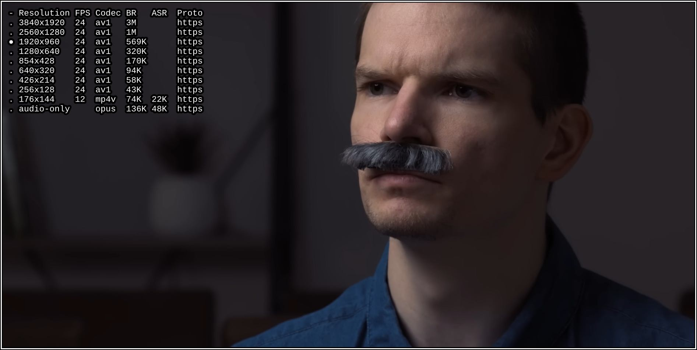
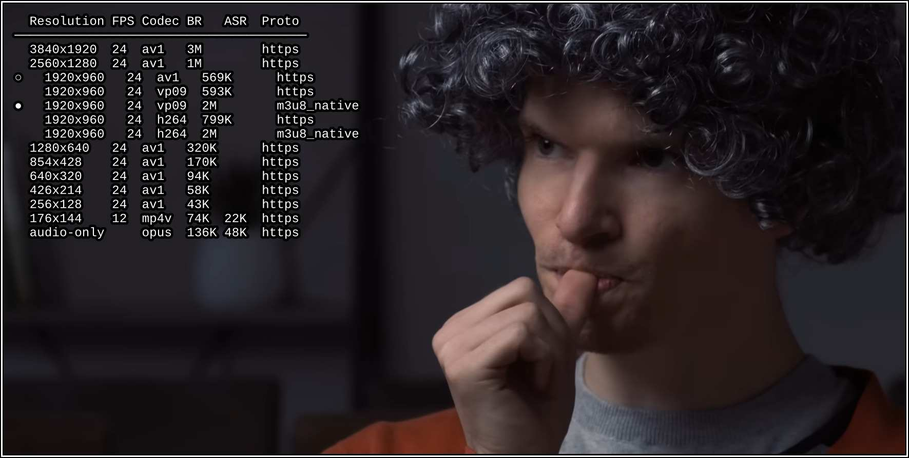

# mpv-selectformat

* [Installation](#installation)
* [Features](#features)
* [Key Bindings](#key-bindings)
* [Available Options](#available-options)
* [Setting a Default Format](#setting-a-default-format)

selectformat is an mpv plugin
for selecting the format of internet videos on the fly.

Based on the unmaintained
[mpv-youtube-quality](https://github.com/jgreco/mpv-youtube-quality).

## Installation

1. Download and copy `selectformat.lua` to your mpv's
[scripts directory](https://mpv.io/manual/stable/#script-location)

2. Add a binding to your mpv's
[input.conf](https://mpv.io/manual/stable/#input-conf) file
for opening the menu
(selectformat doesn't add such binding itself).
Example: `ctrl+f script-binding selectformat/menu`

## Features

- Formats are grouped (folded) based on resolution to reduce clutter
- Formats are properly sorted based on codec, protocol, etc.
- Formats are fetched asynchronously as soon as an internet video starts
- The initially-loaded format is pre-selected in the menu
- More useful info about the formats are displayed compared to mpv-youtube-quality

## Key Bindings

These are the key bindings for navigating the menu.

| Key(s)                 | Function |
|------------------------|----------|
| `Up` or `k`            | Move up
| `Down` or `j`          | Move down
| `PageUp` or `Ctrl+u`   | Move up 5 items
| `PageDown` or `Ctrl+d` | Move down 5 items
| `Home` or `g`          | Jump to the first item
| `End` or `G`           | Jump to the last item
| `Right` or `l`         | Unfold the resolution under the cursor
| `Left` or `h`          | Fold the unfolded resolutions
| `Enter`                | Select the item under the cursor
| `Esc` or `q`           | Close the menu

## Available Options

Take a look at the `options` section in `selectformat.lua`
for available options and their default values.

These options can be configured using mpv's
[script-opts](https://mpv.io/manual/stable/#options-script-opts)
option.

## Setting a Default Format

You can change the default format that mpv loads
by configuring mpv's
[`ytdl-format`](https://mpv.io/manual/stable/#options-ytdl-format)
option in [mpv.conf](https://mpv.io/manual/stable/#configuration-files).
