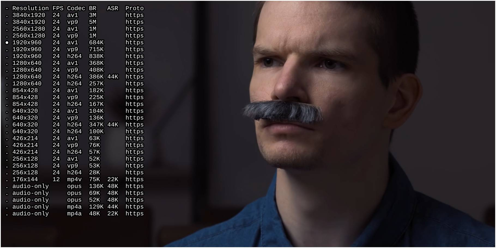

# selectformat

selectformat is an mpv script that allows you to select the
youtube-dl format of the video on the fly.

Based on the unmaintained [mpv-youtube-quality](https://github.com/jgreco/mpv-youtube-quality).

## Install

1. Download and copy `selectformat.lua` to your mpv's [scripts folder](https://mpv.io/manual/stable/#script-location)
2. Add a binding to your mpv's [input.conf file](https://mpv.io/manual/stable/#input-conf) (selectformat doesn't add any bindings itself):
`ctrl+f script-binding selectformat/menu`

## Features

- Formats are properly sorted based on codec, protocol, etc.
- Formats are fetched asynchronously as soon as a network video starts
- The initially loaded format is pre-selected in the menu
- More useful info about the formats are displayed compared to mpv-youtube-quality

## TODO

- [ ] Fold formats with the same resolution into a submenu
- [ ] Proper scrolling in case the menu is longer that the screen height
